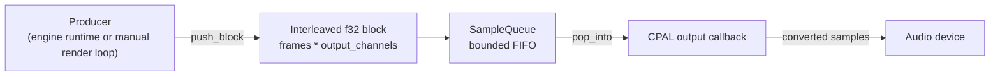
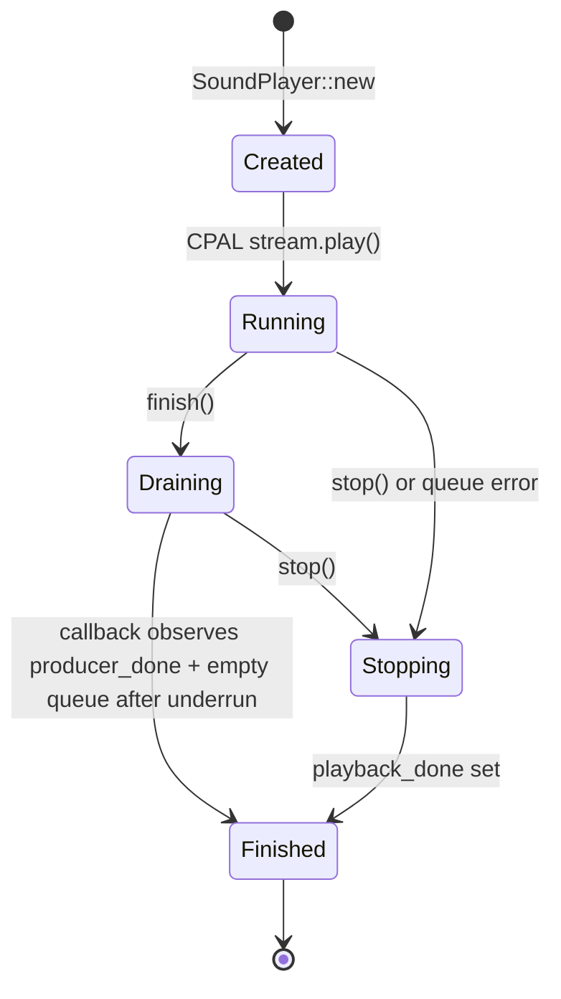
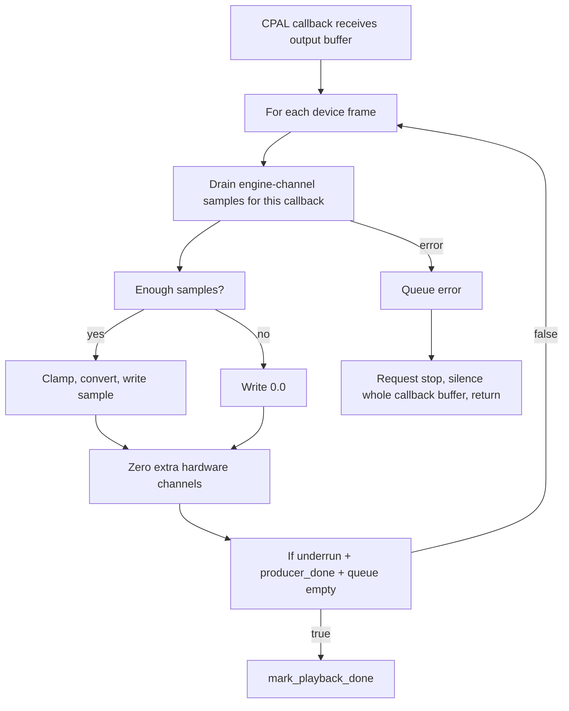
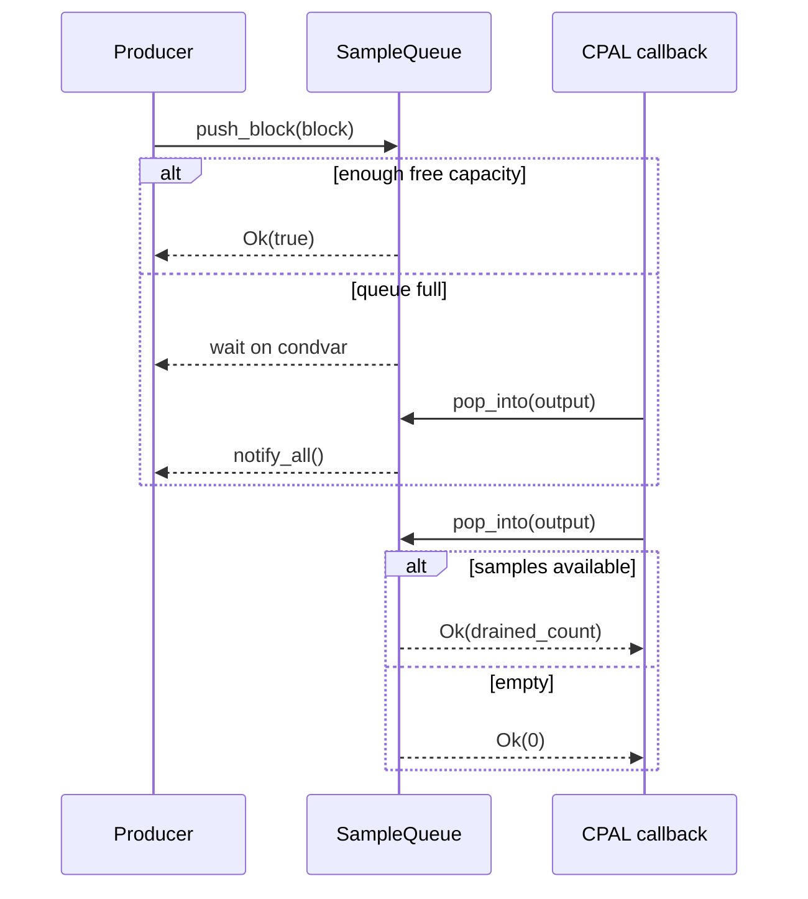
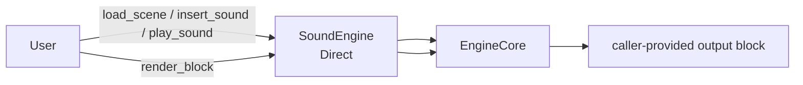
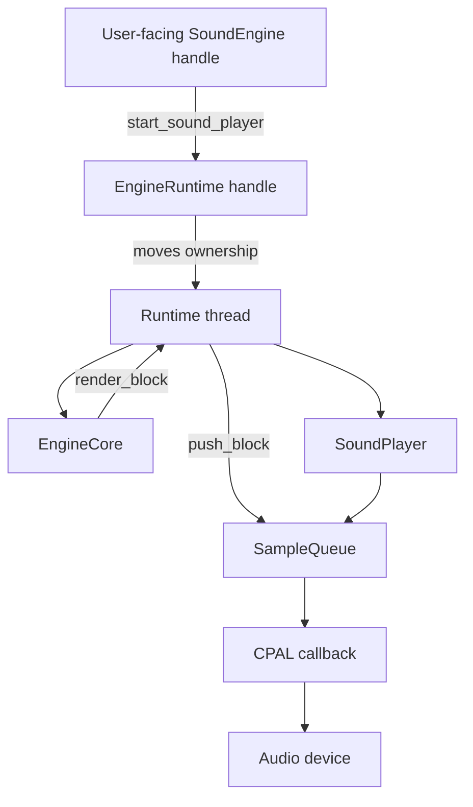
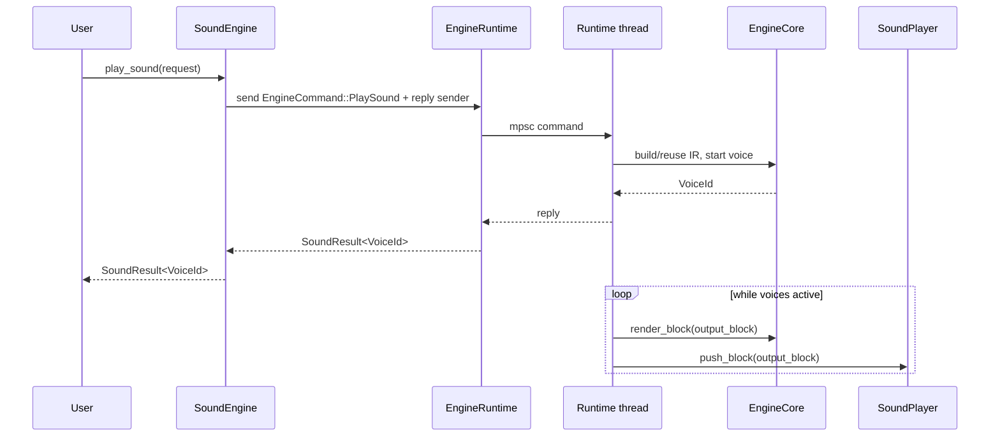
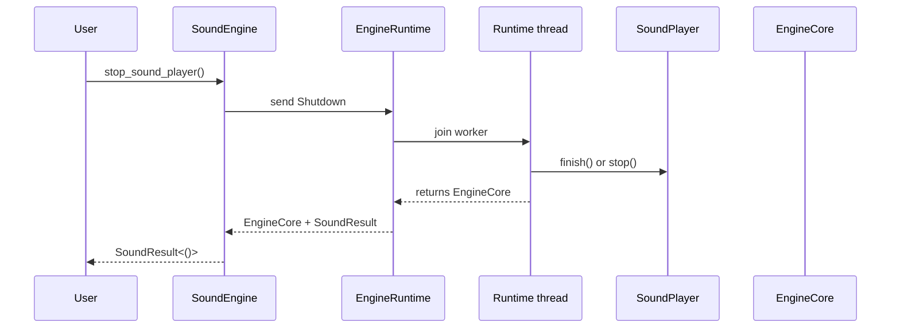

# Playback Module

The `playback` module is the optional audio-device layer of `sound-engine`.
It is enabled by the `playback` Cargo feature and keeps CPAL out of the core
engine build when device playback is not needed.

The module does not own the acoustic scene, sound assets, impulse-response
cache, voices, GPU objects, or auralization engine. Its job is narrower:
accept interleaved `f32` audio blocks that were already rendered elsewhere,
buffer them, and feed them to the OS audio device callback with as little work
as possible.

## Module Responsibilities

`SoundPlayer` is the public playback type. It owns:

- a CPAL output stream
- a bounded `SampleQueue`
- shared `PlaybackState`
- queue sizing derived from `PlaybackConfig`

`SoundPlayer` does not call Vulkan, build impulse responses, render voices, or
own `AuralizationEngine`. A producer must push rendered blocks into it.

The producer can be:

- an example or application loop that manually calls `render_block`
- the `SoundEngine` runtime thread created by `SoundEngine::start_sound_player`

## Files

```text
playback/
  mod.rs      public module exports
  player.rs   public SoundPlayer and PlaybackConfig
  device.rs   CPAL device/stream setup and output callback
  queue.rs    bounded sample queue shared by producer and callback
  state.rs    shared atomic playback state
```

## High-Level Data Flow



The queue stores scalar samples, not frames. For stereo, a rendered block is
expected to be interleaved:

```text
L0, R0, L1, R1, L2, R2, ...
```

For `N` output channels:

```text
frame0_ch0, frame0_ch1, ..., frame0_chN,
frame1_ch0, frame1_ch1, ..., frame1_chN,
...
```

## SoundPlayer Lifecycle



`SoundPlayer::new` validates the configuration, creates a queue, builds a CPAL
stream, and starts it immediately.

`push_block` validates that the submitted block has exactly:

```text
block_size * output_channels
```

samples. If the queue is full, it waits until the callback drains enough space
or until stop is requested.

`finish` means the producer will not submit more samples. It does not stop the
device immediately. The callback continues draining queued samples and writes
silence once the queue is empty.

`wait_until_finished` waits until the callback has observed that the producer is
done and no queued samples remain.

`stop` requests immediate playback shutdown from the producer side. Waiting
`push_block` calls return `Ok(false)` after stop is requested.

## Audio Callback Behavior

The CPAL callback is intentionally small:

1. Drain available samples from `SampleQueue` into a callback scratch buffer.
2. Clamp each sample to `[-1.0, 1.0]`.
3. Convert to the hardware sample type (`f32`, `i16`, or `u16`).
4. Write the configured engine output channels.
5. Zero any extra hardware channels.
6. Write silence on underrun.

It never locks or calls `EngineCore`, `AuralizationEngine`, Vulkan, acoustic IR
generation, scene mutation, or command handling.



The `missing_sample`/underrun check is used only to decide when a finished
producer has truly drained. Without it, playback could mark done as soon as the
last queued samples are copied into a CPAL callback buffer. With it, playback
finishes after a later callback asks for more samples and receives none.

## Queue Behavior

`SampleQueue` is a bounded FIFO protected by a mutex and condition variable.
The producer calls `push_block`; the callback calls `pop_into` once per audio
callback to drain a batch of samples.



If `stop_requested` is set while a producer is waiting for queue space,
`push_block` returns `Ok(false)` instead of accepting more data.

Queue errors are lock-poisoning errors. In the callback, those are treated as
fatal for playback: the callback requests stop, fills the device buffer with
silence, and returns immediately.

## PlaybackState

`PlaybackState` holds the atomics shared between the producer side and the CPAL
callback:

- `producer_done`: no more blocks will be submitted
- `playback_done`: callback has drained finished playback or stop was requested
- `stop_requested`: producer should stop pushing blocks

It also stores the current queue so state transitions can notify any producer
waiting on queue capacity.

`producer_done` and `playback_done` are separate because a producer can finish
before the audio device has actually consumed all queued samples.

## Interaction With SoundEngine

Without the `playback` feature, `SoundEngine` runs only in direct mode:



In direct mode, the user owns the render loop. They call `render_block`, then
decide what to do with the samples.

With the `playback` feature, `SoundEngine::start_sound_player` switches the
engine into runtime mode:



After startup:

- the public `SoundEngine` handle keeps an `EngineRuntime`
- the runtime thread owns `EngineCore`
- the runtime thread owns `SoundPlayer`
- public API calls become commands sent to the runtime thread
- commands that return values use one-shot reply channels
- `SoundEngine::render_block` returns `InvalidState`

This prevents the application thread and playback thread from rendering from
the same engine state at the same time.

## Runtime Command Flow



Commands are processed before rendering each block. If no voices are active,
the runtime blocks waiting for the next command instead of spinning.

## Runtime Stop Flow



After `stop_sound_player`, the public handle returns to direct mode and owns
`EngineCore` again.

## Current Boundaries

The current design deliberately keeps these responsibilities separate:

- `EngineCore` renders audio blocks.
- `EngineRuntime` decides when to render and handles public API commands.
- `SoundPlayer` owns the audio device and sample queue.
- The CPAL callback only drains samples and writes device output.

This avoids doing expensive or blocking work in the audio callback, and it
keeps CPAL optional for users who only need offline rendering, GPU acoustics, or
manual block production.

## Notes And Limitations

- `PlaybackConfig::max_queued_blocks` controls queue capacity.
- `PlaybackConfig::prefill_blocks` is validated, but the current runtime does
  not yet implement an explicit prefill wait before audible playback.
- `render_block` and background playback are mutually exclusive through the
  public `SoundEngine` API.
- Listener changes affect future `play_sound` calls; existing voices do not yet
  crossfade to newly generated IRs.
- The runtime is synchronous from the caller's point of view: public calls wait
  for command replies when a result is required.
